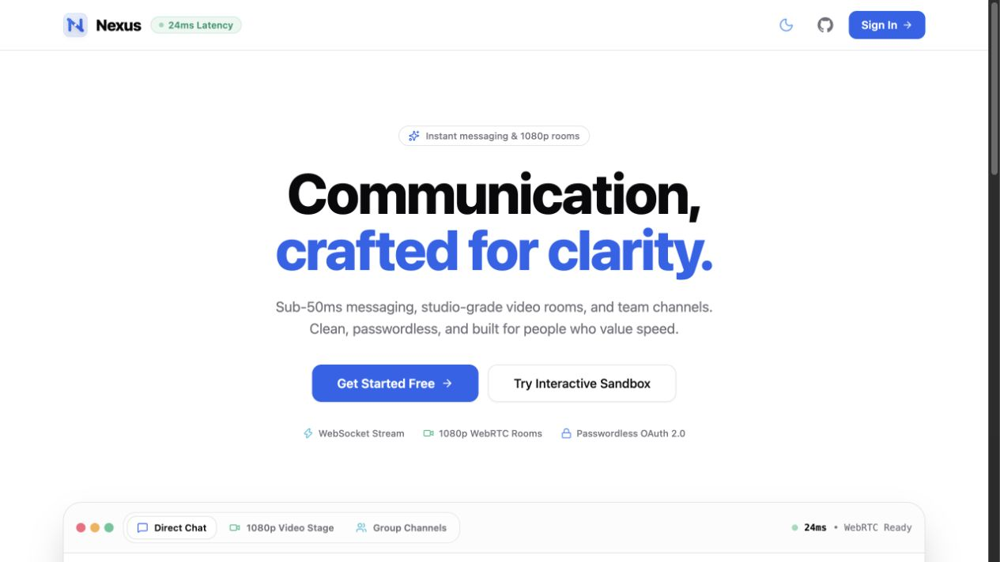
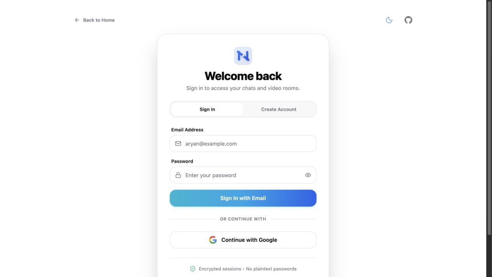
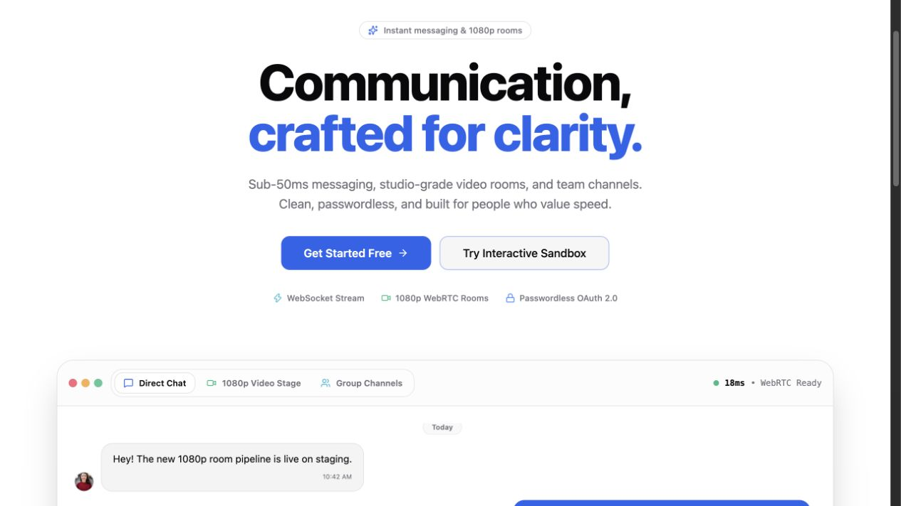

# Nexus

Nexus is a real-time collaboration app for direct messaging, group conversations, media sharing, and authenticated video rooms. The product combines a responsive React client with an Express/Socket.IO API and MongoDB-backed sessions and conversations.

## Product preview

Nexus includes a public landing page, a sign-in flow, and a seeded chat demonstration:



| Sign in | Public chat demo |
| --- | --- |
|  |  |

All screenshots are public or seeded demo states. No production conversations or database-backed user messages are included in this repository preview.

## What is included

- Direct and group conversations with real-time Socket.IO delivery.
- Typing indicators, online presence, read receipts, and conversation list updates.
- Text, image, and video messages with Cloudinary-backed media delivery.
- Edit and delete actions for messages, including synchronized socket events and retryable UI feedback.
- Authenticated 1:1 and group video rooms powered by ZEGOCLOUD WebRTC.
- Email/password authentication and Google OAuth on the client.
- Responsive desktop/mobile chat layouts with light and dark themes.
- Protected REST and WebSocket flows with participant checks, session authentication, rate limits, security headers, and origin validation.

## Architecture

```text
React + TypeScript + Vite + Tailwind CSS
             │
             │ REST (cookie session) + Socket.IO
             ▼
Express + Passport + Socket.IO + Mongoose
             │
             ├── MongoDB / MongoDB Atlas
             ├── Cloudinary media uploads
             └── ZEGOCLOUD token issuance and rooms
```

### Repository layout

```text
.
├── client/              React/Vite frontend
│   ├── src/components/  Chat, navigation, room, and shared UI
│   ├── src/pages/       Landing, auth, chats, people, and room routes
│   └── public/          Static branding assets
├── server/              Express/Socket.IO backend
│   ├── controllers/     Auth and conversation logic
│   ├── models/          User, conversation, and message models
│   ├── routes/          Auth and conversation endpoints
│   ├── sockets/         Authenticated real-time events
│   └── tests/           Tiered API, security, and lifecycle tests
└── docs/screenshots/    README product screenshots
```

## Requirements

- Node.js 18 or newer (Node 20 LTS recommended).
- npm 9 or newer.
- MongoDB locally or a MongoDB Atlas connection string.
- Provider credentials for the features you enable: Google OAuth, Cloudinary, and ZEGOCLOUD.

## Quick start

Clone the repository and install each workspace:

```bash
git clone git@github.com:Aryan-Dahiya-23/nexus.git
cd nexus

npm install --prefix server
npm install --prefix client
```

Create local environment files:

```bash
cp server/.env.example server/.env
cp client/.env.example client/.env
```

Fill in the values described below, then start the two services in separate terminals:

```bash
# Terminal 1 — API and Socket.IO server
npm run dev:server

# Terminal 2 — Vite client
npm run dev:client
```

Open [http://localhost:5174](http://localhost:5174). The client is intentionally pinned to port `5174`; keep the backend `CLIENT_URL` aligned with that origin so cookies, CORS, OAuth callbacks, and Socket.IO handshakes work locally.

## Environment variables

### Backend: `server/.env`

| Variable | Required | Purpose |
| --- | --- | --- |
| `PORT` | Yes | API port; use `4000` locally. |
| `NODE_ENV` | Yes | `development`, `test`, or `production`. |
| `CLIENT_URL` | Yes | Allowed browser origin, usually `http://localhost:5174`. |
| `MONGO_URL` | Yes | MongoDB connection string. |
| `SECRET_KEY` | Yes | Session signing secret; use a long random value. |
| `GOOGLE_CLIENT_ID` | For Google OAuth | Google OAuth client ID. |
| `GOOGLE_CLIENT_SECRET` | For Google OAuth | Google OAuth client secret. |
| `GOOGLE_CALLBACK_URL` | For Google OAuth | Local callback: `http://localhost:4000/auth/google/callback`. |
| `FACEBOOK_CLIENT_ID` | Optional | Backend Facebook OAuth configuration. |
| `FACEBOOK_CLIENT_SECRET` | Optional | Backend Facebook OAuth configuration. |
| `FACEBOOK_CALLBACK_URL` | Optional | Backend Facebook OAuth callback. |
| `ZEGO_APP_ID` | For video rooms | ZEGOCLOUD application ID. |
| `ZEGO_SERVER_SECRET` | For video rooms | ZEGOCLOUD server secret; never expose it to the client. |

### Frontend: `client/.env`

| Variable | Required | Purpose |
| --- | --- | --- |
| `VITE_URL` | Yes | Backend base URL, usually `http://localhost:4000`. |
| `VITE_CLOUDINARY_CLOUD_NAME` | For media | Cloudinary cloud name. |
| `VITE_CLOUDINARY_UPLOAD_PRESET` | For media | Cloudinary unsigned upload preset used by the client. |

Do not commit either `.env` file. The checked-in `.env.example` files contain placeholders only.

## Useful commands

Run commands from the repository root:

```bash
npm run dev:client       # Start Vite on port 5174
npm run dev:server       # Start Express on port 4000
npm run build:client     # Type-check and create the production client bundle
npm run test:server      # Run the server test suite
npm test                 # Server tests, followed by the client build
```

Client-only checks:

```bash
npm run lint --prefix client
npm run typecheck --prefix client
npm run build --prefix client
```

Server syntax checks:

```bash
npm run test:syntax --prefix server
```

## API and health checks

The backend exposes:

- `GET /health/live` — process liveness; returns `200` when the server is running.
- `GET /health/ready` — readiness; returns `200` when MongoDB is connected and `503` otherwise.
- `GET /auth/health` — service health probe used by the landing page.
- `/auth/*` — login, registration, OAuth, session verification, people directory, and logout.
- `/conversation/*` — authenticated conversations, messages, read receipts, and ZEGOCLOUD token issuance.

All conversation routes require an authenticated session. Socket.IO connections also require the same Passport session and are authorized before joining user or conversation rooms.

## Security notes

- Sessions use HTTP-only cookies and MongoDB-backed storage with a seven-day TTL.
- Conversation and message operations validate participant membership and message ownership server-side.
- Socket events derive the actor identity from the authenticated session rather than trusting client-supplied user IDs.
- Helmet, rate limiting, CORS allowlists, and state-changing request origin validation are enabled by the server.
- ZEGOCLOUD server credentials stay on the backend; the client receives room credentials through an authenticated endpoint.
- Production deployments should use HTTPS, `NODE_ENV=production`, a strong `SECRET_KEY`, a production `CLIENT_URL`, and a managed MongoDB deployment.

## Deployment

The frontend can be deployed to Vercel using `client/` as the project root, `npm run build` as the build command, and `dist` as the output directory. The included `client/vercel.json` keeps client-side routes working on refresh.

The backend can be deployed to Render or another Node host using `server/` as the service root and `npm start` as the start command. Configure the backend environment variables in the hosting provider, then set the frontend `VITE_URL` to the deployed API URL and the backend `CLIENT_URL` to the deployed frontend URL.

## License

ISC © [Aryan Dahiya](https://github.com/Aryan-Dahiya-23)
